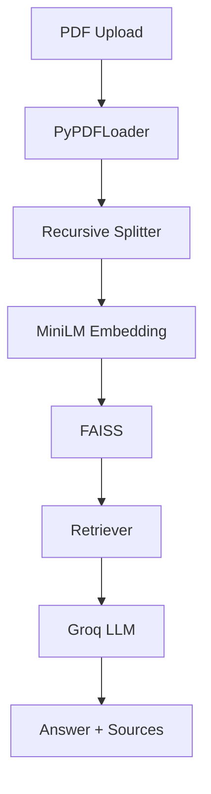

# Citesage - Multi-Document RAG with Cited Answers


Answer questions across multiple PDFs with verifiable support from the actual source documents, including filename and page number citations.

## Problem
Users often need answers from multiple PDFs, but standard file search is not enough. This project builds a simple multi-document retrieval pipeline that can read PDFs, embed them locally, retrieve relevant chunks, and generate answers with source citations.

## Architecture



## Tech Stack
- Python
- LangChain
- PyPDF
- Hugging Face sentence-transformers
- FAISS
- Groq Llama 3.1 8B
- Streamlit

## Project Structure
```text
citesage/
├── data/
├── src/
│   ├── ingest.py
│   ├── embed_store.py
│   ├── retrieve.py
│   ├── generate.py
│   └── eval.py
├── app.py
├── requirements.txt
├── .env.example
├── .gitignore
├── README.md
├── .streamlit/
│   └── config.toml
└── faiss_index/
```

## Setup
1. Clone the repository
2. Create a virtual environment
3. Install dependencies:
   ```bash
   pip install -r requirements.txt
   ```
4. Add your Groq API key:
   ```bash
   cp .env.example .env
   ```
   Then edit `.env` and set:
   ```bash
   GROQ_API_KEY=gsk_...
   ```
5. Put your PDF files into the `data/` folder
6. Build the FAISS index:
   ```bash
   python src/ingest.py
   ```
7. Run the app:
   ```bash
   streamlit run app.py
   ```

## Sample Q&A
Example:
- Question: "What are the main risks mentioned in the documents?"
- Answer: "The documents highlight ... "
- Sources: `[report.pdf - page 2]`, `[notes.pdf - page 5]`

## Limitations
- Chunk size tuning can affect answer quality
- Hallucination risk can still happen in edge cases
- Small-scale local FAISS setup is fine for demos, not large enterprise corpora
- Better evaluation would include RAGAS and a bigger benchmark set

## What I'd Improve
- Tune chunk size and overlap
- Add better grounding and citation validation
- Add a richer evaluation harness with RAGAS
- Scale storage and querying for larger document collections

## Live Demo
Coming soon.

## Notes
This project is intentionally lightweight and easy to run locally without paid APIs. The embedding model runs locally, and the LLM call uses Groq's free tier-compatible API.
